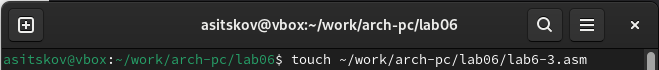
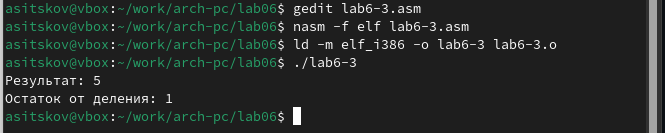

---
## Front matter
title: "Отчет по лабораторной работе №6"
subtitle: "Дисциплина: архитектура компьютера"
author: "Ицков Андрей Станиславович"

## Generic otions
lang: ru-RU
toc-title: "Содержание"

## Bibliography
bibliography: bib/cite.bib
csl: pandoc/csl/gost-r-7-0-5-2008-numeric.csl

## Pdf output format
toc: true # Table of contents
toc-depth: 2
lof: true # List of figures
fontsize: 12pt
linestretch: 1.5
papersize: a4
documentclass: scrreprt
## I18n polyglossia
polyglossia-lang:
  name: russian
  options:
	- spelling=modern
	- babelshorthands=true
polyglossia-otherlangs:
  name: english
## I18n babel
babel-lang: russian
babel-otherlangs: english
## Fonts
mainfont: PT Serif
romanfont: PT Serif
sansfont: PT Sans
monofont: PT Mono
mainfontoptions: Ligatures=TeX
romanfontoptions: Ligatures=TeX
sansfontoptions: Ligatures=TeX,Scale=MatchLowercase
monofontoptions: Scale=MatchLowercase,Scale=0.9
## Biblatex
biblatex: true
biblio-style: "gost-numeric"
biblatexoptions:
  - parentracker=true
  - backend=biber
  - hyperref=auto
  - language=auto
  - autolang=other*
  - citestyle=gost-numeric
## Pandoc-crossref LaTeX customization
figureTitle: "Рис."
listingTitle: "Листинг"
lofTitle: "Список иллюстраций"
lolTitle: "Листинги"
## Misc options
indent: true
header-includes:
  - \usepackage{indentfirst}
  - \usepackage{float} # keep figures where there are in the text
  - \floatplacement{figure}{H} # keep figures where there are in the text
---

# Цель работы

Цель данной лабораторной работы - освоение арифметческих инструкций языка ассемблера NASM.

# Задание

1. Символьные и численные данные в NASM
2. Выполнение арифметических операций в NASM
3. Выполнение заданий для самостоятельной работы

# Теоретическое введение

Большинство инструкций на языке ассемблера требуют обработки операндов. Адрес операнда предоставляет место, где хранятся данные, подлежащие обработке. Это могут быть данные хранящиеся в регистре или в ячейке памяти. 
- Регистровая адресация – операнды хранятся в регистрах и в команде используются имена этих регистров, например: mov ax,bx.
- Непосредственная адресация – значение операнда задается непосредственно в команде, Например: mov ax,2.
- Адресация памяти – операнд задает адрес в памяти. В команде указывается символическое обозначение ячейки памяти, над содержимым которой требуется выполнить операцию.

Ввод информации с клавиатуры и вывод её на экран осуществляется в символьном виде. Кодирование этой информации производится согласно кодовой таблице символов ASCII. ASCII – сокращение от American Standard Code for Information Interchange (Американский стандартный код для обмена информацией). Согласно стандарту ASCII каждый символ кодируется одним байтом.
Среди инструкций NASM нет такой, которая выводит числа (не в символьном виде). Поэтому, например, чтобы вывести число, надо предварительно преобразовать его цифры в ASCII-коды этих цифр и выводить на экран эти коды, а не само число. Если же выводить число на экран непосредственно, то экран воспримет его не как число, а как последовательность ASCII-символов – каждый байт числа будет воспринят как один ASCII-символ – и выведет на экран эти символы.
Аналогичная ситуация происходит и при вводе данных с клавиатуры. Введенные данные будут представлять собой символы, что сделает невозможным получение корректного результата при выполнении над ними арифметических операций.
Для решения этой проблемы необходимо проводить преобразование ASCII символов в числа и обратно

# Выполнение лабораторной работы

## Символьные и численные данные в NASM

С помощью утилиты mkdir создаю директорию, перемещаюсь туда и создаю там файл lab6-1.asm (рис. [-@fig:001]).

{ #fig:001 width=70% }

Вставляю в созданный файл данную мне программу (рис. [-@fig:002]).

{ #fig:002 width=70% }

Создаю исполняемый файл программы и запускаю его (рис. [-@fig:003]).

{ #fig:003 width=70% }

Ввожу в текст программы запрашиваемые изменения (рис. [-@fig:004]).

{ #fig:004 width=70% }

Снова создаю исполняемый файл программы и запускаю его (рис. [-@fig:005]).

{ #fig:005 width=70% }

Создаю новый файл lab6-2.asm и ввожу туда текст новой программы (рис. [-@fig:006]). 

{ #fig:006 width=70% }

Редактирую текст программы (рис. [-@fig:007]).

{ #fig:007 width=70% }

Создаю исполняемый файл программы и запускаю его (рис. [-@fig:008]).

{ #fig:008 width=70% }

Заменяю iprintLF на iprint в тексте программы (рис. [-@fig:009]).

{ #fig:009 width=70% }

Снова создаю и запускаю исполняемый файл lab6-2 (рис. [-@fig:010]).

{ #fig:010 width=70% }

## Выполнение арифметических операций в NASM

Создаю пустой файл lab6-3.asm (рис. [-@fig:011]).

{ #fig:011 width=70% }

Ввожу туда данную мне программу (рис. [-@fig:012]).

{ #fig:012 width=70% }

Запускаю программы и получаю результат выражения (рис. [-@fig:013]).

{ #fig:013 width=70% }

Изменяю программу так, чтобы она вычисляла значение выражения f(x) = (4 * 6 + 2)/5 (рис. [-@fig:014]).

{ #fig:014 width=70% }

Запускаю программы и получаю новый результат (рис. [-@fig:015]).

{ #fig:015 width=70% }

Создаю файл variant.asm и ввожу туда данную мне программу (рис. [-@fig:016]).

{ #fig:016 width=70% }

Программа выдала мне номер моего варианта (рис. [-@fig:017]).

{ #fig:017 width=70% }

## Выполнение заданий для самостоятельной работы

Решаю задачу (рис. [-@fig:018]). 

{ #fig:018 width=70% }

Получаю ответы (рис. [-@fig:019]).

{ #fig:019 width=70% }

Создаю файл variant.asm с помощью  утилиты touch (рис. [-@fig:020]).

{ #fig:020 width=70% }

### Ответы на вопросы по программе

1. За вывод сообщения "Ваш вариант" отвечают строки кода:

```NASM
mov eax,rem
call sprint
```
2. Инструкция mov ecx, x используется, чтобы положить адрес вводимой строки x в регистр ecx
mov edx, 80 - запись в регистр edx длины вводимой строки 
call sread - вызов подпрограммы из внешнего файла, обеспечивающей ввод сообщения с клавиатуры  

3. call atoi используется для вызова подпрограммы из внешнего файла, которая преобразует ascii-код символа в целое число и записывает результат в регистр eax

4. За вычисления варианта отвечают строки:

```NASM
xor edx,edx ; обнуление edx для корректной работы div
mov ebx,20 ; ebx = 20
div ebx ; eax = eax/20, edx - остаток от деления
inc edx ; edx = edx + 1
```

5. При выполнении инструкции div ebx остаток от деления записывается в регистр edx

6. Инструкция inc edx увеличивает значение регистра edx на 1

7. За вывод на экран результатов вычислений отвечают строки:

```NASM
mov eax,edx
call iprintLF
```

# Выводы

При выполнении данной лабораторной работы я освоила арифметические инструкции языка ассемблера NASM.

# Список литературы

1. [Лабораторная работа №7](https://esystem.rudn.ru/pluginfile.php/1584637/mod_resource/content/1/%D0%9B%D0%B0%D0%B1%D0%BE%D1%80%D0%B0%D1%82%D0%BE%D1%80%D0%BD%D0%B0%D1%8F%20%D1%80%D0%B0%D0%B1%D0%BE%D1%82%D0%B0%20%E2%84%967.pdf)
2. [Таблица ASCII](https://www.rapidtables.com/code/text/ascii-table.html)

